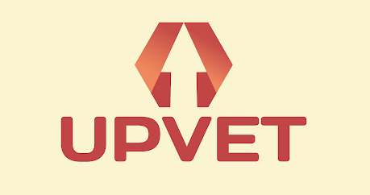

# UpVet

## What is it? 
UpVet is a application that will improve the way military members learn about benefits and resources. Members post benefits they discovered and will be able to promote other benefits. UpVet strives to have a community of military members, past and present, contributing to the greater good and supporting one another. Members will also be able to communicate with other members to discuss the listed benefits and encourages community driven growth. 

## But why? 

Veterans have access to numerous benefits to help improve their lives but most will never find these benefits because they become lost in "the internet". Veteran benefits are chaotically scattered throughout the internet with no consolidated location for easy access, UpVet plans to address this issue by creating a platform to have benefits provided by and endorsed by its members. Members will be able to post benefits/businesses/resources that help the military community. Members will also be able to "upvote" popular benefits to get the highest value benefits recognized.

## Whose UpVet for? 
UpVet is for members of the military community who want want to have a consolidated location for their benefits and interact with other members within the military community.

## Application Flow
The following is a demo of the dashboard of UpVet

## Built With
Frontend: [HTML, CSS, React]

## Completion Status
The project is currently in development with only a front end, but plans to create a live project in the MERN stack are in progress.

